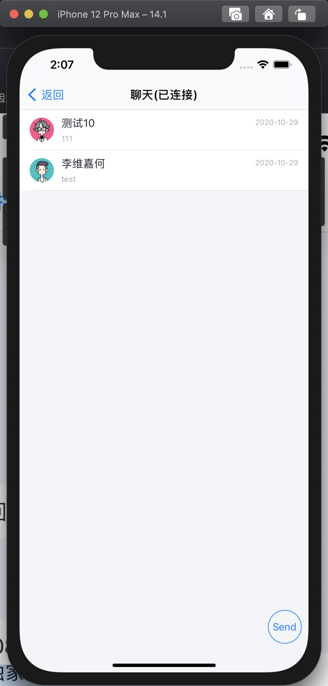
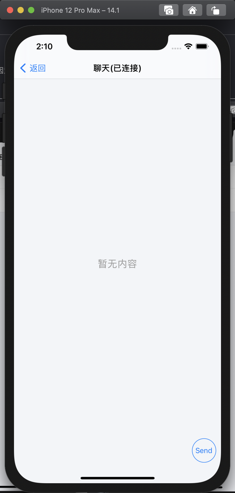

# 构建会话列表

## 效果展示

图中未展示发送者昵称和头像是因为未设置用户信息，具体如何设置请参考 [设置用户信息]()

| 有数据 | 无数据|
| - | - |
|  |  |

```objc
/*!
 会话列表界面类
 */
@interface TCConversationListViewController : UIViewController <UITableViewDataSource, UITableViewDelegate>
```

## 构建说明

开发者可通过两种方式使用会话列表页面。

1. 直接使用此类

    建议仅在排查会话列表的相关错误时使用，如果在使用此页面期间出现了相关问题，可以直接 push 到此类排查是否能复现相关问题。

2. 继承使用此类

    开发者可继承此类，并跳转到此页面来开发相关内容。

## 代码示例

```objc
ConversationListViewController *conversation = [ConversationListViewController new];
[self.navigationController pushViewController:conversation animated:YES];
```

