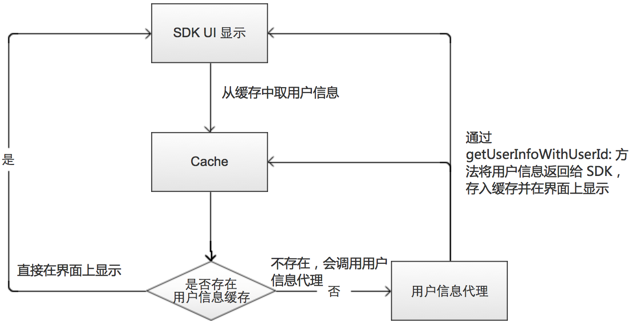

# 设置用户的用户信息

## 设置用户信息

IMKit 设计了用户信息提供者，开发者只需要实现该协议并提供正确的数据，IMKit 会在会话列表或会话页面需要展示用户头像和昵称的时候，去调用对应协议的代理函数并根据返回的信息显示用户的名称与头像。此方法自动对该用户进行了信息的缓存。在 App 存活的生命周期中，之后该用户需要显示的时候，便不会触发该方法，SDK 自动遍历缓存的数据。这个方法由 TCIM 类创建单例进行实现，整个工程中只需要实现一次。

`逻辑说明:`



>当会话列表或者会话界面中对应的用户需要显示的时候，每一个用户都会触发这个方法，所以协议方法中的参数 UserID 就是对应这个需要显示的用户的 ID，这个 ID 是已知的，可以直接应用。开发者需要通过 UserID 获取到 UserID 对应的保存在自己服务器的用户信息并实现完整回调。

### 实现此功能需要开发者遵守 TCIMUserInfoDataSource 协议。

`代理对象参数说明:`

| 参数 | 类型 | 必填 | 说明 |
| - | - | - | - |
| userInfoDataSource | id<TCIMUserInfoDataSource> | 是 | 用户信息提供者 |

`协议方法参数说明:`

| 参数 | 类型 | 说明 |
| - | - | - |
| userId | NSString | 用户 ID |
| completion | Block | 获取用户信息完成之后需要执行的 Block |

`回调参数说明:`

| 参数 | 类型 | 必填 | 说明 |
| - | - | - | - |
| userInfo | TCUserInfo | 是 | 该用户ID对应的用户信息 |

`代码示例:`

1. 设置代理对象:

```objc
[[TCIM sharedTCIM] setUserInfoDataSource:self];
```

2. 实现协议方法:

```objc
- (void)getUserInfoWithUserId:(nonnull NSString *)userId completion:(nonnull void (^)(TCUserInfo * _Nonnull))completion {
    // 开发者调自己的服务器接口根据userID异步请求数据
    TCUserInfo *userInfo = [TCUserInfo initWithUserId:userId name:@"userName" portrait:@"avatarUrl"];
    completion(userInfo);
}
```

## 获取用户信息

开发者可通过下面方法获取 SDK 中缓存的用户信息。此处获取的是开发者通过 设置用户信息 接口传递给 SDK 的用户信息，如果没有传递，此处会返回空。

`输入参数说明:`

| 参数 | 类型 | 必填 | 说明 |
| - | - | - | - |
| userId | NSString | 是 | 用户 ID |

`返回参数说明:`

| 返回值 | 返回类型 | 说明 |
| - | - | - |
| userInfo | TCUserInfo | SDK 中缓存的用户信息 |

`代码示例:`

```objc
TCUserInfo *userInfo = [[TCIM sharedTCIM] getUserInfoCache:@"userId"];
```

## 更新用户信息

开发者可通过下面方法更新 SDK 缓存的用户信息。

`参数说明:`

| 参数 | 类型 | 必填 | 说明 |
| - | - | - | - |
| userId | NSString | 是 | 需要更新的用户ID |

`代码示例:`

```objc
[[TCIM sharedTCIM] refreshUserInfoCache:@"userId"];
```

