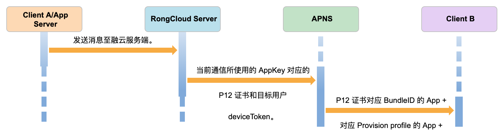

# 功能描述

当 App 进入后台 2 分钟之后或被杀进程或被冻结，SDK 将处于后台暂停状态。此时融云的长连接通道会断开，融云 Server 会通过 APNs 将消息以远程推送的形式下发到客户端。 此状态下如果有人给该用户发送消息，融云的服务器会根据 deviceToken 和推送证书将消息发送到苹果推送服务器，苹果服务器会将该消息推送到客户端。

`流转图:`



# 请求推送权限

`请求推送权限:`

```objc
- (BOOL)application:(UIApplication *)application didFinishLaunchingWithOptions:(NSDictionary *)launchOptions {
    UNUserNotificationCenter *center = [UNUserNotificationCenter currentNotificationCenter];
    center.delegate = self;
    [center requestAuthorizationWithOptions:(UNAuthorizationOptionSound | UNAuthorizationOptionAlert | UNAuthorizationOptionBadge) completionHandler:^(BOOL granted, NSError * _Nullable error) {
    }];
    [application registerForRemoteNotifications];
}
```

`设置 deviceToken:`

```objc
- (void)application:(UIApplication *)application didRegisterForRemoteNotificationsWithDeviceToken:(NSData *)deviceToken {
    [[TCIMClient sharedTCIMClient] setDeviceTokenData:deviceToken];
}
```

### 开发者在集成完上述文档之后，可直接测试推送是否集成成功。

>1. deviceToken 是唯一标识客户端的凭证，所以必须上传应用服务器才能使用远程推送。
>2. 模拟器收不到远程推送。
>3. 越狱的设备 APNs 服务不能保证，所以不一定能收到远程推送。
>4. APNs 使用 BundleID 区分 App，使用通配符 BundleID 的 App 将无法使用远程推送。

# 获取推送内容

## 解析 `UNNotificationResponse`

`输入参数:`

| 参数 | 类型 | 必填 | 说明 |
| - | - | - | - |
| response | UNNotificationResponse | 是 | ios系统通知结果 |

`返回参数:`

| 参数 | 类型 | 说明 |
| - | - | - |
| notification | TCNotification | 封装后的通知结构 |

`示例代码:`

```objc
TCNotification *notification = [[TCIMClient sharedTCIMClient] getTCNotificationWithNotificationResponse:response];
```

## 点击通知栏的远程推送时，开发者可使用下面方式使用:

```objc
- (void)userNotificationCenter:(UNUserNotificationCenter *)center didReceiveNotificationResponse:(UNNotificationResponse *)response withCompletionHandler:(void(^)(void))completionHandler{
    TCNotification *notification = [[TCIMClient sharedTCIMClient] getTCNotificationWithNotificationResponse:response];
    UINavigationController * nav = (UINavigationController * )self.window.rootViewController;
    ConversationViewController *conversation = [[ConversationViewController alloc] initWithConversationType:notification.conversationType targetId:notification.targetId conversationTitle:nil];
    [nav pushViewController:conversation animated:YES];
}
```

