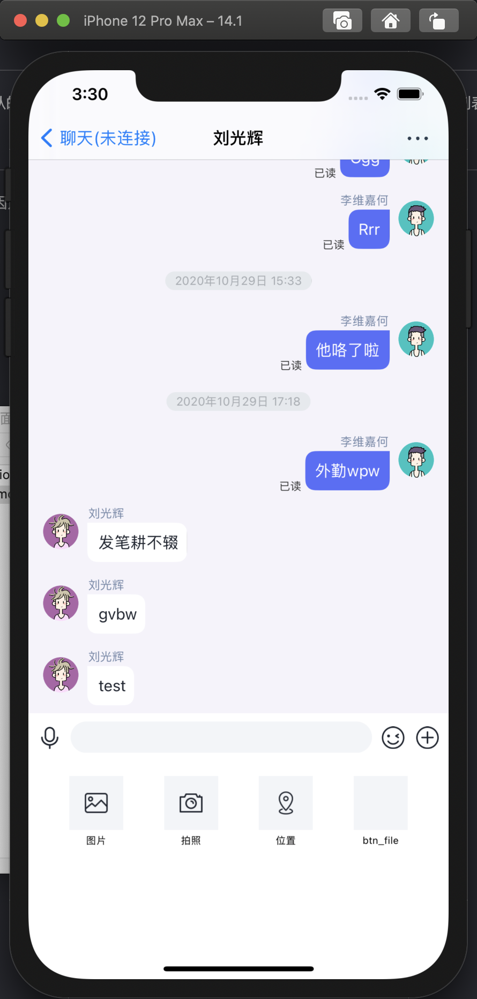

# 功能描述

卓朗云 IMKit 已经实现了一个默认的会话视图控制器，直接使用或继承此类，即可快速启动和使用会话列表界面。

# 效果展示

图中未展示发送者昵称和头像是因为未设置用户信息，具体如何设置请参考 设置用户信息

| 会话界面 | 插件版界面 |
| - | - |
|  |  |

# 构建会话界面

```objc
@interface TCConversationViewController : UIViewController
```

## 构建说明

开发者可通过两种方式使用会话列表页面。

1. 直接使用此类

    建议仅在排查会话列表的相关错误时使用，如果在使用此页面期间出现了相关问题，可以直接 push 到此类排查是否能复现相关问题。

2. 继承使用此类

    开发者可继承此类，并跳转到此页面来开发相关内容。

## 参数说明

| 参数 | 类型 | 必填 | 说明 |
| - | - | - | - |
| conversationType | TCConversationType | 是 | 会话类型 |
| targetId | NSString | 是 | 接收方的 targetId |

## 方法原型

```objc
- (id)initWithConversationType:(TCConversationType)conversationType targetId:(NSString *)targetId conversationTitle:(NSString*)conversationTitle;
```

## 代码示例

```objc
ConversationViewController *conversation = [[ConversationViewController alloc] initWithConversationType:ConversationType_PRIVATE targetId:@"targetId" conversationTitle:@"title"];
[self.navigationController pushViewController:conversation animated:YES];
```